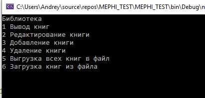
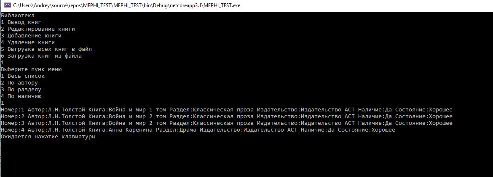
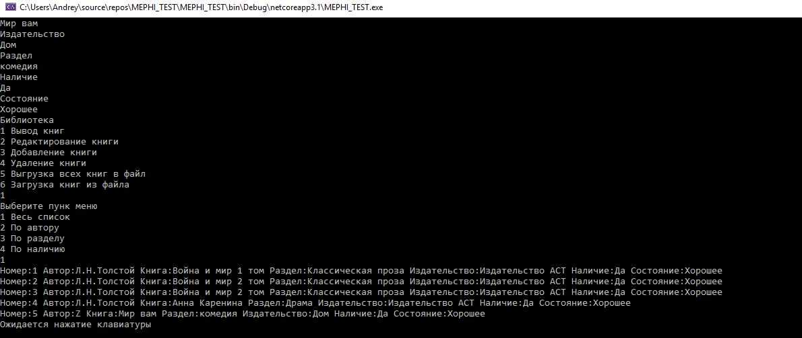
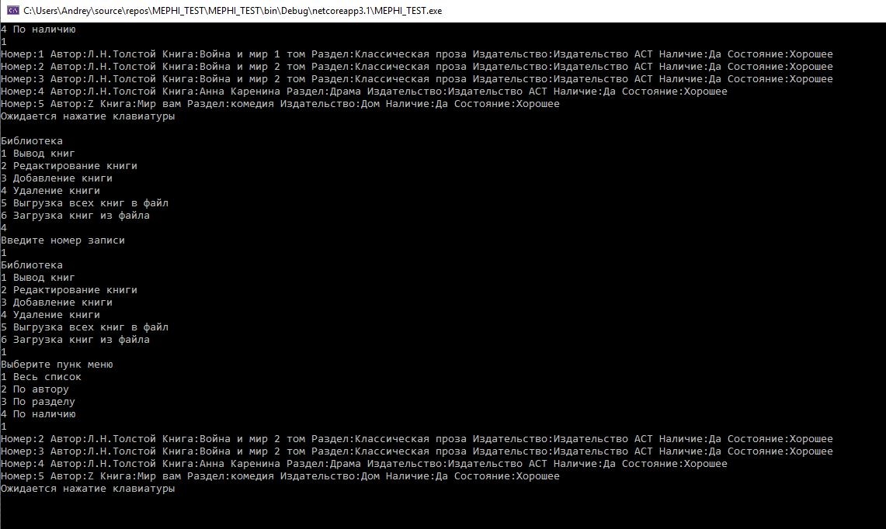
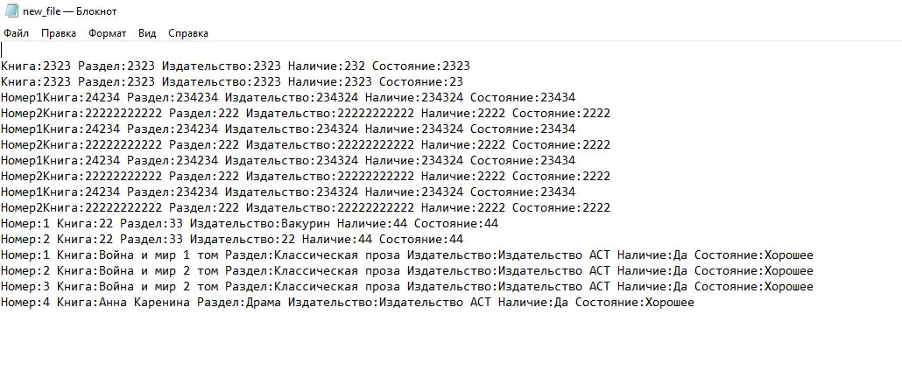

Разработать программу, реализующую картотеку библиотеки: выходные данные книги (автор, название, издательство), раздел библиотеки (спец. литература, беллетристика), наличие книги в данный момент, субъективная оценка. Картотека должна позволять:
1. 	Вывод книг по произвольному запросу (по автору, разделу, наличию)
2. 	Редактирование записи (изменение параметров)
3. 	Добавление/ удаление книги
4. 	Загрузка/сохранение картотеки в файл

Код программы находится в файлах:
Program.cs - весь код 
Class1.cs - класс book

Файл для запуска \bin\Debug\netcoreapp3.1\MEPHI_TEST.exe

Демонстрация программы представлена на изображениях ниже

